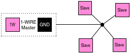

# 1-Wire

> 1-Wire is a device communications bus system which provides data, signaling, and power over a single conductor. It is similar in concept to I²C, but with lower data rates and longer range. It is typically used to communicate with small inexpensive devices such as digital thermometers and weather instruments.

* [Wikipedia article](https://www.wikiwand.com/en/1-Wire)
* [Manufacturer website](https://www.maximintegrated.com/en/products/digital/one-wire.html)

## Pin variant

The UX2-1IS pin variant includes a 1-Wire interface:

## Wiring

The 1-Wire interface actually comprises of two wires, `1W` (data and power) and `GND`, often utilising shieded CAT5 network cable:

* Master `1W` connects to the `1-Wire` pin on the slave
* Master `GND` connects to the `GND` pin on the slave

In many cases, slaves are configured for parasitic powering by leeching from the `1W` cable via a capacitor connected between `1W` and `GND`. Slaves often operate at either 3V or 5V; you might require a voltage level translator (see [App Note 4477](https://www.maximintegrated.com/en/an4477) on manufacturer website for details).

1-Wire facilitates several wiring topologies as summarised below. There are different electrical characteristics for each topology which can impair reliability if not properly managed. For detailed information, please see [Tutorual 148](https://www.maximintegrated.com/en/app-notes/index.mvp/id/148) on the manufacturer website.

The **linear topology** has a main cable which stretches from the master to the farthest slave (sensor). Additional slaves are connected along the main cable, often by short stretches of wire:

The **stubbed topology** is similar to linear, but intermediate slaves are connected to the main wire by longer cables (usually with lengths in excess of 3m):

The **star topology** has slaves connected by cables to a central point:

It is also possible to create switched topologies, where different branches of slaves can be enabled or disabled via a switch in the 1-Wire cable.

## Host considerations

It is strongly advised to use an MCU or FPGA which has hardware support for 1-Wire. Alternatively, there are dedicated 1-Wire driver ICs available from the manufacturer. For more details, please see [App Note 4206](https://www.maximintegrated.com/en/an4206) on the manufacturer website.