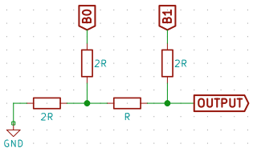

# Choosing pin variant

There are two common ways to set the pin variant:

1. Hard-code via firmware on the MCU or configuration on an FPGA
2. Physical jumpers or dip switches (see below)

Two bits (`B0`, `B1`) are required to represent the 4 possible pin variants; easily achieved with jumpers or dip switches:

| B0 | B1 |  Pinout  |
| -- | -- | -------- |
| 0  | 0  | UX2-GPIO |
| 0  | 1  | UX2-ALT  |
| 1  | 0  | UX2-1IS  |
| 1  | 1  | UX2-I2C  |

Use [R-2R resistor ladder](https://www.wikiwand.com/en/Resistor_ladder#/R.E2.80.932R_resistor_ladder_network_.28digital_to_analog_conversion.29)
[DAC](https://www.wikiwand.com/en/Digital-to-analog_converter) to merge digital bits in to single analog value that can be read by single
MCU/FPGA pin:

## See also

* [UX2 Overview](../README.md)
* [Protocols](../protocols/README.md)
* [Modules](../modules/README.md)
